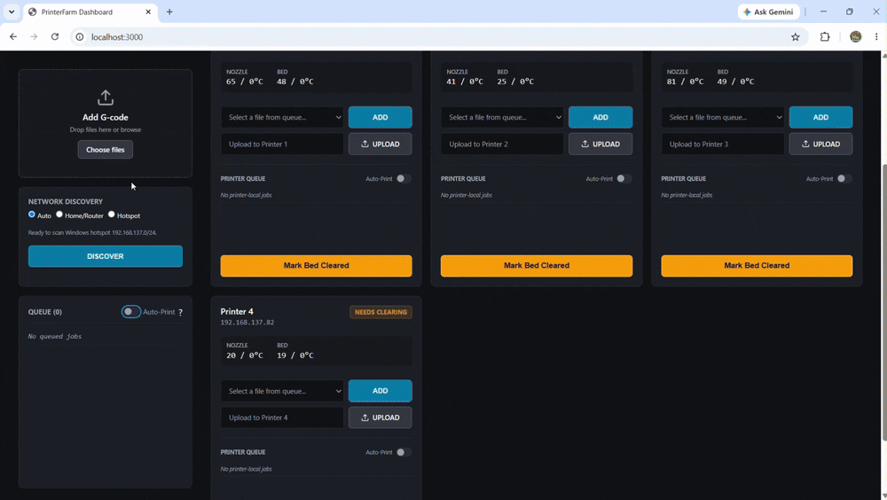

# PrintFarm



Running more than one Creality printer usually means walking between them with an SD
card, or bolting a Raspberry Pi to each one. PrintFarm is a third option: a dashboard
that runs on your computer and talks to the printers over your network, using the LAN
interface they already have.

Nothing gets flashed, rooted, or modified. There's no Pi, no OctoPrint, no Moonraker,
no cloud account, and no USB cable.

## Quickstart

About five minutes, once.

| | Step |
|---|---|
| 1 | Install [Node.js LTS](https://nodejs.org) — leave *"Tools for Native Modules"* unchecked |
| 2 | Download the zip from the [latest release](https://github.com/ashimaryal25/printfarm/releases/latest) and extract it |
| 3 | Open a terminal in that folder — Shift + right-click → *Open in Terminal* |
| 4 | Run `npm start` |
| 5 | Open **http://127.0.0.1:3000** and click **DISCOVER** |

There's no `npm install` step — PrintFarm has zero dependencies, so it just runs. Keep
the terminal window open; closing it stops PrintFarm.

Prefer git? Clone it instead of steps 2 and 3, then carry on from step 4:

```bash
git clone https://github.com/ashimaryal25/printfarm.git
cd printfarm
```

## What you can do with it

Once your printers show up, everything happens from the one page:

- **Watch everything at once** — state, temperatures, current file, layer, and progress
  for every printer side by side.
- **Send G-code over the network** instead of walking an SD card over. Drop files into a
  shared queue, or into one printer's own queue.
- **Let it pick the printer.** Turn on Auto-Print and the next free machine takes the
  next job. A printer can also be reserved so it only pulls from its own queue.
- **Pause, resume, and cancel** without getting up.
- **Stop it printing onto a finished part.** A printer that just finished stays locked
  until you confirm you've cleared the bed.

One thing worth knowing up front: your queue lives in memory, so restarting PrintFarm
clears it. Your printer list is saved and comes back.

## Finding your printers


Click **DISCOVER** and PrintFarm scans one private network at a time looking for
printers that answer.

- **Auto** picks a private network it can see, preferring the Windows hotspot range.
- **Home / Router** takes your own subnet or any address on it — `192.168.1` or
  `192.168.1.42` both work.
- **Hotspot** uses the Windows hotspot range, `192.168.137.0/24`.

If discovery finds nothing on campus or office Wi-Fi, that's usually the network, not
PrintFarm — most of them block devices from talking to each other. A laptop hotspot,
phone hotspot, or cheap travel router gets around it, which is what the clip above shows.

Whatever it finds is written to `printers.json` next to the app, so your printers are
still there next time. You can also skip discovery entirely: copy
`printers.example.json` to `printers.json` and type the addresses in yourself.

## Using it from your phone

By default the dashboard only listens on your own machine. To reach it from a phone on
the same network, bind it to your LAN:

```powershell
$env:HOST="0.0.0.0"
npm start
```

Then open `http://<your-computer-ip>:3000` on the phone. Windows will ask about the
firewall — allow private networks only, and never put PrintFarm on the public internet.

## How Auto-Print decides

Auto-Print comes in two flavours that stay out of each other's way. A printer with its
own Auto-Print on only takes jobs from its own queue, and the shared queue skips it.
Everything else pulls from the shared queue.

Before anything starts, PrintFarm checks that the printer really is free and that no
upload or command is already in flight. When a job ends — finished, cancelled, or
failed — that printer goes to `NEEDS CLEARING` and won't accept another job until you
clear the bed and say so in the dashboard.

## No printer? Use the simulator

There's a full fake printer included, so you can try the whole thing — uploads,
Auto-Print, pause, resume, cancel, bed clearing — without owning any hardware.

```bash
# terminal A: a fake Creality printer on localhost
node bin/mock-printer.mjs

# terminal B: point PrintFarm at it
echo '[{ "id": "1", "ip": "127.0.0.1" }]' > printers.json
npm start
```

Upload any `.gcode` file, add it to Printer 1, and hit START. The simulator heats up,
reports progress, and finishes like the real thing.

## Which printers work

PrintFarm goes after a protocol rather than a model list: any stock Creality printer
that exposes the LAN WebSocket on port 9999 plus HTTP upload is a candidate, and
discovery tries it automatically.

| Model | Status |
|---|---|
| Ender 3 V3 KE | Verified on physical hardware |
| K1, K1 Max, K1C | Experimental — same protocol family, unverified |
| CR-10 SE | Experimental — protocol unconfirmed |
| K2, K2 Plus | Not supported — different transfer interface |
| CR-M4 | Not supported — legacy CXSWBox networking |

*Verified* means I own one and test on it. *Experimental* means discovery and starting a
print should work, but details like pause confirmation or telemetry field names may differ
by firmware — I can't confirm without the hardware. If you have one of those printers,
telling me what happened is how rows move up.

This is an unofficial protocol, so a firmware update can change it. If something breaks,
include your model, firmware version, and the server log.

**Got a printer that isn't listed?** The vendor-specific bits live in four files, and the
usual difference is a renamed telemetry field — a one-line change.
[CONTRIBUTING.md](CONTRIBUTING.md) shows where those seams are, how to capture what your
printer actually sends (the dashboard has a raw telemetry view for exactly this), and how
to test a change against the simulator.

## Settings

| Variable | Default | What it does |
|---|---|---|
| `HOST` | `127.0.0.1` | Address the dashboard listens on |
| `PORT` | `3000` | Dashboard port |
| `HTTP_PORT` | `80` | Port used to upload to printers. The bundled simulator answers on `9999`, which is used automatically for `127.0.0.1`. |
| `GCODE_DIR` | `/usr/data/printer_data/gcodes` | Where files land on the printer |

Uploads are capped at 100 MB and kept in `scratch/`.

## Security

There's no login. Anyone who can reach the dashboard can upload files and drive your
printers. Keep it on a network you trust, and don't leave heated, moving machines running
unsupervised.

## Development

```bash
npm test              # unit tests
npm run test:integration   # full flow against the simulator
npm run verify        # both, plus syntax checks
```

The unit tests cover protocol parsing, discovery bounds, state classification, queue
routing, and control safety. The integration test drives a real upload → Auto-Print →
pause → resume → cancel cycle against the simulator, so none of it needs hardware.

[ARCHITECTURE.md](ARCHITECTURE.md) explains how the pieces fit together, and
[ROADMAP.md](ROADMAP.md) lists what's deliberately not built yet.

## License

MIT. PrintFarm is an unofficial community project, not affiliated with or endorsed by
Creality.
